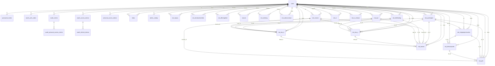

# Simei Database ERD v2

```mermaid
erDiagram
  users ||--o{ password_resets : ""
  users ||--o{ oauth_auth_codes : ""
  users ||--o{ oauth_access_tokens : ""
  users ||--o{ oauth_clients : ""
  oauth_clients ||--o{ oauth_personal_access_clients : ""
  oauth_access_tokens ||--o{ oauth_refresh_tokens : ""
  users ||--o{ personal_access_tokens : ""
  users ||--o{ inbox : "from"
  users ||--o{ inbox : "to"
  users ||--o{ admin_configs : ""
  users ||--o{ md_inquiry : "from"
  users ||--o{ md_inquiry : "to"
  users ||--o{ md_introductionletter : "from"
  users ||--o{ md_introductionletter : "to"
  users ||--o{ md_offeringletter : "from"
  users ||--o{ md_offeringletter : "to"
  users ||--o{ md_lkn : "from"
  users ||--o{ md_lkn : "to"
  users ||--o{ md_ordering : "from"
  users ||--o{ md_ordering : "to"
  users ||--o{ md_salescontract : "from"
  users ||--o{ md_salescontract : "to"
  users ||--o{ md_invoice : "from"
  users ||--o{ md_invoice : "to"
  users ||--o{ md_packinglist : "from"
  users ||--o{ md_packinglist : "to"
  users ||--o{ md_shippinginstruction : "from"
  users ||--o{ md_shippinginstruction : "to"
  users ||--o{ md_deliveryorder : "from"
  users ||--o{ md_deliveryorder : "to"
  users ||--o{ md_billoflading : "from"
  users ||--o{ md_billoflading : "to"
  users ||--o{ md_ska_a : "from"
  users ||--o{ md_ska_a : "to"
  users ||--o{ md_ska_d : "from"
  users ||--o{ md_ska_d : "to"
  users ||--o{ md_wessel : "from"
  users ||--o{ md_wessel : "to"
  users ||--o{ md_lc : "from"
  users ||--o{ md_lc : "to"
  users ||--o{ md_lc_release : "from"
  users ||--o{ md_lc_release : "to"
  users ||--o{ md_peb : "from"
  users ||--o{ md_peb : "to"
  users ||--o{ md_npe : "from"
  users ||--o{ md_npe : "to"

  md_packinglist ||--o{ md_shippinginstruction : "pl_id"
  md_packinglist ||--o{ md_ska_a : "pl_id"
  md_packinglist ||--o{ md_ska_d : "pl_id"
  md_packinglist ||--o{ md_wessel : "pl_id"
  md_packinglist ||--o{ md_peb : "pl_id"
  md_shippinginstruction ||--o{ md_deliveryorder : "si_id"
  md_shippinginstruction ||--o{ md_peb : "si_id"
  md_deliveryorder ||--o{ md_peb : "do_id"
  md_invoice ||--o{ md_ska_a : "invoice_id"
  md_invoice ||--o{ md_ska_d : "invoice_id"
  md_invoice ||--o{ md_wessel : "invoice_id"
  md_invoice ||--o{ md_peb : "invoice_id"
  md_billoflading ||--o{ md_ska_a : "bl_id"
  md_billoflading ||--o{ md_ska_d : "bl_id"
  md_billoflading ||--o{ md_wessel : "bl_id"
  md_npe ||--o{ md_ska_a : "npe_id"
  md_npe ||--o{ md_ska_d : "npe_id"
  md_npe ||--o{ md_wessel : "npe_id"
  md_ska_a ||--o{ md_wessel : "skaa_id"
  md_ska_d ||--o{ md_wessel : "skad_id"
```
