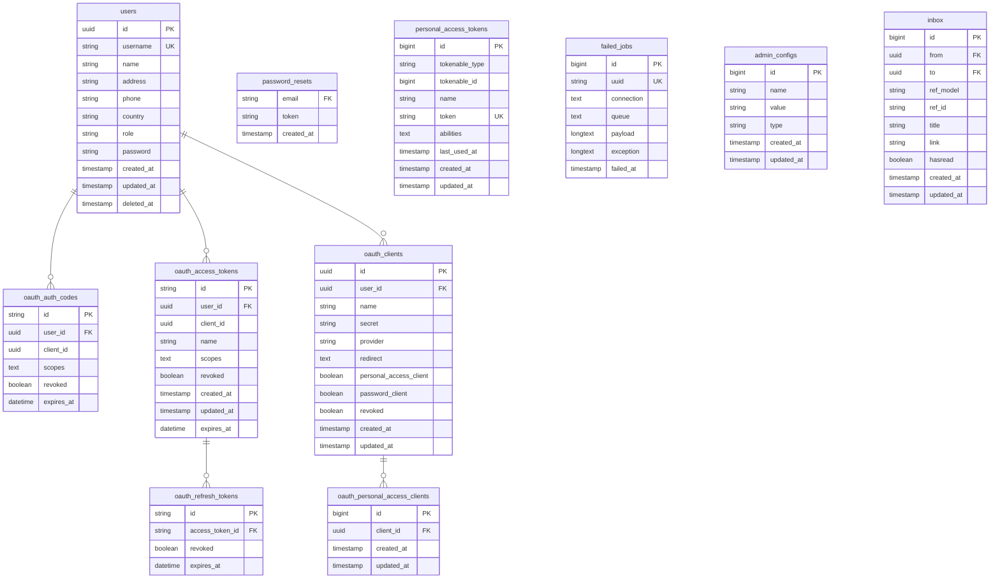
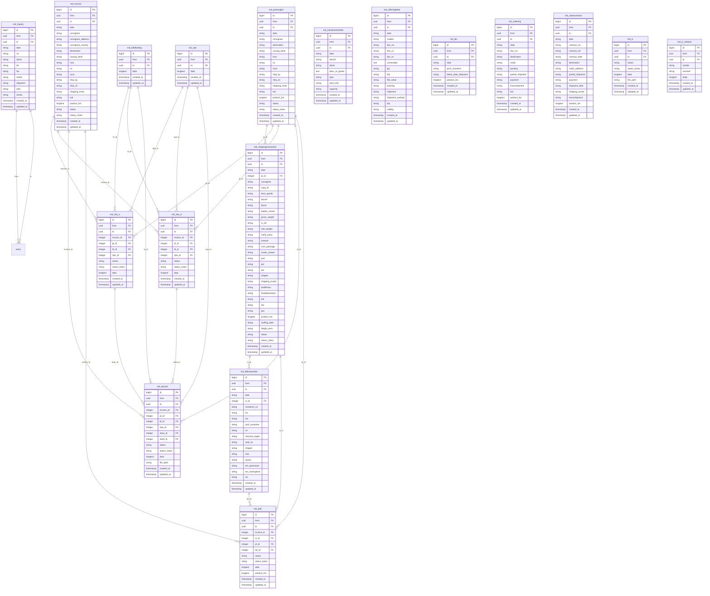
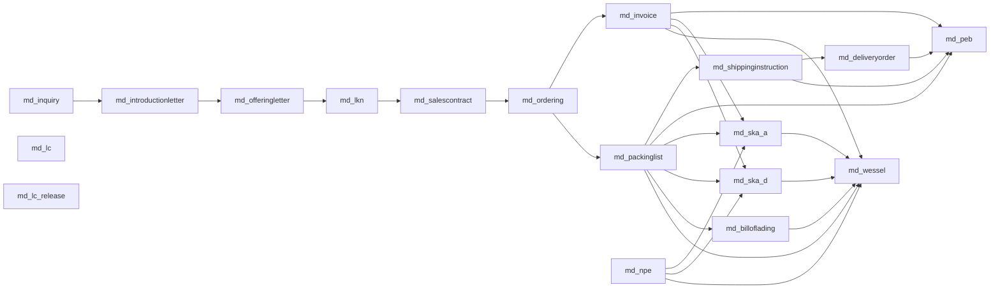

# Simei Database ERD

## Infrastructure & Auth

```mermaid
erDiagram
  users ||--o{ oauth_auth_codes : ""
  users ||--o{ oauth_access_tokens : ""
  users ||--o{ oauth_clients : ""
  oauth_clients ||--o{ oauth_personal_access_clients : ""
  oauth_access_tokens ||--o{ oauth_refresh_tokens : ""

  users {
    uuid id PK
    string username UK
    string name
    string address
    string phone
    string country
    string role
    string password
    timestamp created_at
    timestamp updated_at
    timestamp deleted_at
  }

  password_resets {
    string email FK
    string token
    timestamp created_at
  }

  oauth_auth_codes {
    string id PK
    uuid user_id FK
    uuid client_id
    text scopes
    boolean revoked
    datetime expires_at
  }

  oauth_access_tokens {
    string id PK
    uuid user_id FK
    uuid client_id
    string name
    text scopes
    boolean revoked
    timestamp created_at
    timestamp updated_at
    datetime expires_at
  }

  oauth_refresh_tokens {
    string id PK
    string access_token_id FK
    boolean revoked
    datetime expires_at
  }

  oauth_clients {
    uuid id PK
    uuid user_id FK
    string name
    string secret
    string provider
    text redirect
    boolean personal_access_client
    boolean password_client
    boolean revoked
    timestamp created_at
    timestamp updated_at
  }

  oauth_personal_access_clients {
    bigint id PK
    uuid client_id FK
    timestamp created_at
    timestamp updated_at
  }

  personal_access_tokens {
    bigint id PK
    string tokenable_type
    bigint tokenable_id
    string name
    string token UK
    text abilities
    timestamp last_used_at
    timestamp created_at
    timestamp updated_at
  }

  failed_jobs {
    bigint id PK
    string uuid UK
    text connection
    text queue
    longtext payload
    longtext exception
    timestamp failed_at
  }

  admin_configs {
    bigint id PK
    string name
    string value
    string type
    timestamp created_at
    timestamp updated_at
  }

  inbox {
    bigint id PK
    uuid from FK
    uuid to FK
    string ref_model
    string ref_id
    string title
    string link
    boolean hasread
    timestamp created_at
    timestamp updated_at
  }
```

## Business Documents

```mermaid
erDiagram
  md_inquiry ||--o{ users : "from"
  md_inquiry ||--o{ users : "to"
  md_invoice ||--o{ md_ska_a : "invoice_id"
  md_invoice ||--o{ md_ska_d : "invoice_id"
  md_invoice ||--o{ md_wessel : "invoice_id"
  md_invoice ||--o{ md_peb : "invoice_id"
  md_packinglist ||--o{ md_shippinginstruction : "pl_id"
  md_packinglist ||--o{ md_ska_a : "pl_id"
  md_packinglist ||--o{ md_ska_d : "pl_id"
  md_packinglist ||--o{ md_wessel : "pl_id"
  md_packinglist ||--o{ md_peb : "pl_id"
  md_shippinginstruction ||--o{ md_deliveryorder : "si_id"
  md_shippinginstruction ||--o{ md_peb : "si_id"
  md_deliveryorder ||--o{ md_peb : "do_id"
  md_billoflading ||--o{ md_ska_a : "bl_id"
  md_billoflading ||--o{ md_ska_d : "bl_id"
  md_billoflading ||--o{ md_wessel : "bl_id"
  md_npe ||--o{ md_ska_a : "npe_id"
  md_npe ||--o{ md_ska_d : "npe_id"
  md_npe ||--o{ md_wessel : "npe_id"
  md_ska_a ||--o{ md_wessel : "skaa_id"
  md_ska_d ||--o{ md_wessel : "skad_id"

  md_inquiry {
    bigint id PK
    uuid from FK
    uuid to FK
    string date
    string no
    string docto
    string tel
    string fax
    string article
    string shipment
    string who
    string sentto
    timestamp created_at
    timestamp updated_at
  }

  md_introductionletter {
    bigint id PK
    uuid from FK
    uuid to FK
    string date
    string docref
    string docto
    text desc_of_goods
    string type
    string price_fob
    string capacity
    timestamp created_at
    timestamp updated_at
  }

  md_offeringletter {
    bigint id PK
    uuid from FK
    uuid to FK
    string date
    string nodate
    string doc_no
    string doc_cc
    string doc_to
    text commodity
    string qty
    string fob
    string fob_value
    string packing
    string shipment
    string shipment_method
    string top
    string validity
    timestamp created_at
    timestamp updated_at
  }

  md_lkn {
    bigint id PK
    uuid from FK
    uuid to FK
    string date
    string jenis_incoterm
    string latest_date_shipment
    longtext product_list
    timestamp created_at
    timestamp updated_at
  }

  md_ordering {
    bigint id PK
    uuid from FK
    uuid to FK
    string date
    string doc_no
    string destination
    string notify
    string packing
    string partial_shipment
    string payment
    string transshipment
    string tod
    longtext product_list
    timestamp created_at
    timestamp updated_at
  }

  md_salescontract {
    bigint id PK
    uuid from FK
    uuid to FK
    string date
    string contract_no
    string contract_ref
    string contract_date
    string destination
    string notify_address
    string partial_shipment
    string payment
    string shipment_date
    string shipping_marks
    string transshipment
    longtext product_list
    timestamp created_at
    timestamp updated_at
  }

  md_invoice {
    bigint id PK
    uuid from FK
    uuid to FK
    string date
    string consignee
    string consignee_address
    string consignee_country
    string destination
    string issuing_bank
    string lcno
    string no
    string scno
    string ship_by
    string ship_on
    string shipping_mark
    string tod
    longtext product_list
    string status
    string status_notes
    timestamp created_at
    timestamp updated_at
  }

  md_packinglist {
    bigint id PK
    uuid from FK
    uuid to FK
    string date
    string consignee
    string destination
    string issuing_bank
    string lcno
    string no
    string scno
    string ship_by
    string ship_on
    string shipping_mark
    string tod
    longtext product_list
    string status
    string status_notes
    timestamp created_at
    timestamp updated_at
  }

  md_shippinginstruction {
    bigint id PK
    uuid from FK
    uuid to FK
    string date
    integer pl_id FK
    string consignee
    string copy_bl
    string desc_goods
    string docref
    string docto
    string feeder_vessel
    string gross_weight
    string lc_ref
    string nett_weight
    string notify_party
    string toname
    string num_package
    string ocean_vessel
    string pod
    string pol
    string por
    string shipper
    string shipping_marks
    string podelivery
    string finaldestination
    string etd
    string eta
    string qoc
    longtext product_list
    string stuffing_date
    string freight_term
    string status
    string status_notes
    timestamp created_at
    timestamp updated_at
  }

  md_deliveryorder {
    bigint id PK
    uuid from FK
    uuid to FK
    string date
    integer si_id FK
    string container_no
    string est
    string hal
    string juml_container
    string no
    string rencana_kapal
    string seal_no
    string shipper
    string sino
    string tujuan
    string est_openstack
    string est_closingtime
    string utc
    timestamp created_at
    timestamp updated_at
  }

  md_billoflading {
    bigint id PK
    uuid from FK
    uuid to FK
    longtext data
    timestamp created_at
    timestamp updated_at
  }

  md_ska_a {
    bigint id PK
    uuid from FK
    uuid to FK
    integer invoice_id FK
    integer pl_id FK
    integer bl_id FK
    integer npe_id FK
    string status
    string status_notes
    longtext data
    timestamp created_at
    timestamp updated_at
  }

  md_ska_d {
    bigint id PK
    uuid from FK
    uuid to FK
    integer invoice_id FK
    integer pl_id FK
    integer bl_id FK
    integer npe_id FK
    string status
    string status_notes
    longtext data
    timestamp created_at
    timestamp updated_at
  }

  md_wessel {
    bigint id PK
    uuid from FK
    uuid to FK
    integer invoice_id FK
    integer pl_id FK
    integer bl_id FK
    integer npe_id FK
    integer skaa_id FK
    integer skad_id FK
    string status
    string status_notes
    longtext data
    string file_path
    timestamp created_at
    timestamp updated_at
  }

  md_lc {
    bigint id PK
    uuid from FK
    uuid to FK
    string status
    string status_notes
    longtext data
    string file_path
    timestamp created_at
    timestamp updated_at
  }

  md_lc_release {
    bigint id PK
    uuid from FK
    uuid to FK
    string sender
    string receiver
    longtext body
    timestamp created_at
    timestamp updated_at
  }

  md_peb {
    bigint id PK
    uuid from FK
    uuid to FK
    integer invoice_id FK
    integer si_id FK
    integer pl_id FK
    integer do_id FK
    string status
    string status_notes
    longtext data
    longtext product_list
    timestamp created_at
    timestamp updated_at
  }

  md_npe {
    bigint id PK
    uuid from FK
    uuid to FK
    longtext data
    timestamp created_at
    timestamp updated_at
  }
```

## Business Document Flow

```mermaid
flowchart LR
  IQ[md_inquiry] --> IL[md_introductionletter]
  IL --> OL[md_offeringletter]
  OL --> LKN[md_lkn]
  LKN --> SC[md_salescontract]
  SC --> ORD[md_ordering]
  ORD --> INV[md_invoice]
  ORD --> PL[md_packinglist]
  PL --> SI[md_shippinginstruction]
  SI --> DO[md_deliveryorder]
  INV --> PEB[md_peb]
  SI --> PEB
  PL --> PEB
  DO --> PEB
  INV --> SKAA[md_ska_a]
  INV --> SKAD[md_ska_d]
  PL --> SKAA
  PL --> SKAD
  PL --> BL[md_billoflading]
  NPE[md_npe] --> SKAA
  NPE --> SKAD
  NPE --> WS[md_wessel]
  INV --> WS
  PL --> WS
  BL --> WS
  SKAA --> WS
  SKAD --> WS
  LC[md_lc]
  LCR[md_lc_release]
```
